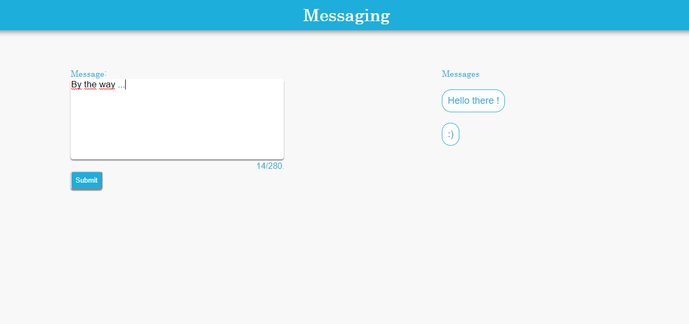

   

    
<h6 align = "center">SigmaΣCode</h6>

<h1 align="center">Message Box</h1>

 JavaScript Application.

 

## Captures

    

## Features

- The looks like is inspired on twitter.
- Use of Local Storage using a simple message system
- Many validations to ensure your text is clean.

## See it online

- [`netlify`](https://messagebox.netlify.com)  

## Links to other proyects

- [`Final Fantasy VII Menu`](https://github.com/LeonAGA/Final_Fantasy_VII_Menu)
- [`BlackBoard`](https://github.com/LeonAGA/Blackboard)
- [`Agenda`](https://github.com/LeonAGA/Agenda)    
- [`Currency_to_Cryptocurrency_Converter`](https://github.com/LeonAGA/Currency_to_Cryptocurrency_Converter)    

